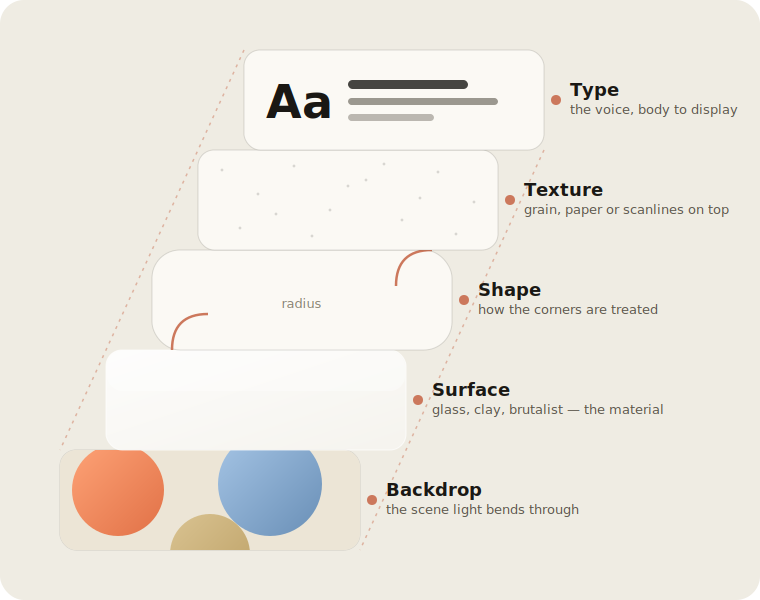
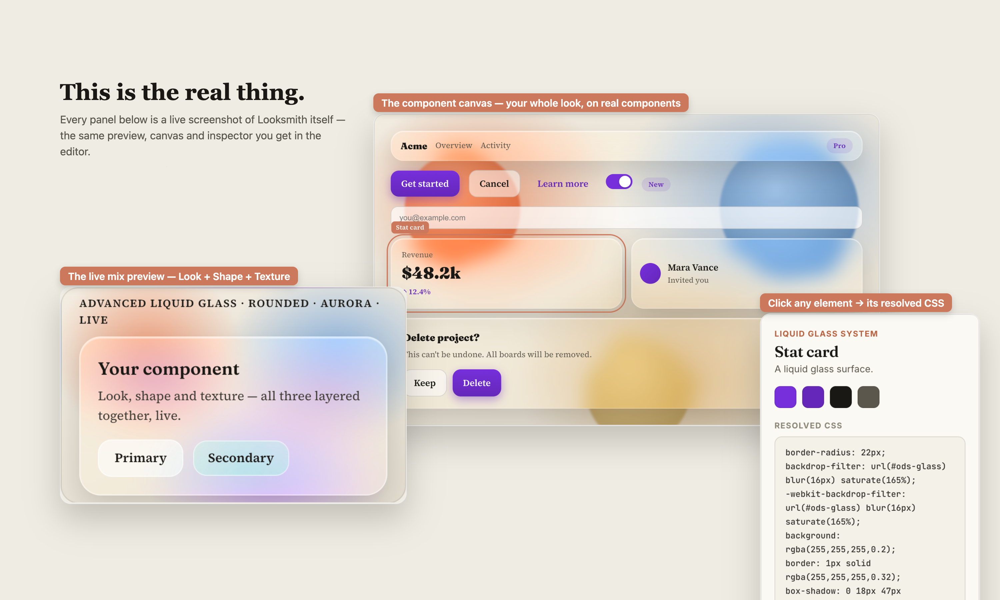
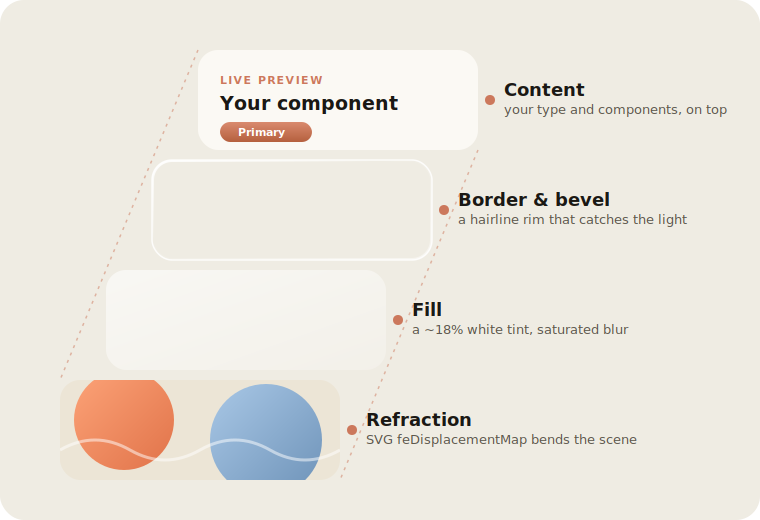

<div align="center">

# Looksmith

### Forge a look, not a default.

Looksmith is a small, offline-friendly studio for **deciding what your app should look like** — and turning that decision into one precise prompt you can hand to any AI coding tool.

You don't write the prompt. You mix a look, the way you'd noodle in Figma, and Looksmith writes it for you.

</div>

---

## Why it exists

Ask an AI to "build me a dashboard" and you get the house style: the same rounded cards, the same blue-violet gradient, the same Inter-at-three-weights that every other AI-built app is wearing this season. To get something that's actually *yours*, you burn credits re-rolling — "make it more editorial", "no, warmer", "now glassy but not that glassy" — describing taste you can see in your head but can't quite put into words.

Looksmith flips that around. You make the visual decisions **by looking at real samples**, and it does the describing — once, precisely, in language a model can actually act on.

---

## How a look is built

Every look in Looksmith is a small stack of decisions. They're independent on purpose, so they genuinely compose instead of fighting each other:

<div align="center">



</div>

- **Backdrop** — the scene a glass surface refracts, so translucency reads as real depth instead of a grey blur.
- **Surface** — the material itself: glass, clay, brutalist, soft-extruded. This is your *look*.
- **Shape** — how corners are treated, from hard 90° to full pills to organic blobs. Works the same over any surface.
- **Texture** — an overlay: film grain, paper tooth, static, CRT scanlines — plus effects borrowed from other looks (a liquid-glass pane, an aurora wash, a neon glow, holographic shimmer) that lay over whatever surface you picked.
- **Type** — the voice, from a quiet body grotesque up to a wide display face. Some shapes even nudge it — pick *Organic* and the headings soften to a rounded face to match.

Pick one surface, then layer a shape and a texture on top. Because shape and texture only touch corners and overlays, they compose cleanly with *any* surface — so Claymorphism-with-sharp-corners-and-paper-grain, or Bauhaus-with-a-glass-pane, is a real, previewable thing, not a setting that quietly does nothing.

### …and it's not a mockup

Every preview in Looksmith is the real component, rendered live. Here's the editor's own preview, component canvas and CSS inspector, pulled straight out of the running app:

<div align="center">



</div>

---

## The signature trick: real liquid glass

The glass surfaces aren't a blurred rectangle with a white border. They actually bend the scene behind them, using an SVG `feTurbulence` + `feDisplacementMap` filter wired into `backdrop-filter` — no third-party library. That's why there's a real backdrop behind every preview: without something to refract, glass is just fog.

<div align="center">



</div>

---

## What you get out

A single Markdown prompt, built from your choices, that spells out:

- the project type and overall direction,
- the base look (with concrete CSS techniques pulled from it),
- your shape and texture, as plain instructions,
- a `:root` block of real design tokens — radius, blur, shadow, accent, the works,
- typography, including any fonts you uploaded yourself,
- and a short list of things to get right regardless of style (contrast, keyboard access, responsiveness).

Paste it into your tool of choice. Change anything earlier and it rewrites itself.

---

## The flow

Seven steps, each one mostly *looking* rather than reading:

1. **Project** — what you're building. Sets the tone for everything after.
2. **Foundation** — Material, Fluent or Apple, shown as live samples.
3. **Style Mix** — pick a look, then a shape and a texture. Preview composes all three for real.
4. **Type** — choose a pairing from body to display, or drop in your own `.woff2` / `.ttf` / `.otf`.
5. **Mixer** — fine-tune the surface with sliders (radius, blur, refraction, grain, accent hue…).
6. **Components** — your whole look on real buttons, inputs, cards and dialogs. Click any one to read the exact CSS behind it.
7. **Prompt** — copy it, or download the `.md`.

There's a coach alongside the mixer that reacts to what you've picked — nudging you toward a shape and texture once you've got a base, or flagging when two choices pull against each other.

---

## What's in the box

- **46 design styles** across material/morphism, structure, vibe, spatial and AI-native — each with a live sample that actually looks like itself (Liquid Glass, Claymorphism, Swiss Modernism, Vaporwave, Risograph, Dark Academia, Memphis, Cyberpunk Neon, and plenty more).
- **34 type pairings**, from neutral grotesques to wide display faces, plus your own uploads.
- **6 shapes** and **5 textures** that compose over any look.
- Everything runs **client-side** and persists to `localStorage`, so your work survives a reload and the whole thing installs as a PWA.

---

## Running it locally

```bash
npm install
npm run dev      # vite dev server on :5173
npm run build    # production build to dist/
npm run preview  # preview the production build
```

Vite + React 18 + TypeScript. No backend — the "engine" (the style knowledge base and the prompt builder) is all in the browser.

### Deploying

The build is published to GitHub Pages by `.github/workflows/deploy-pages.yml` on every push to `new` or `main`. The base path comes from `VITE_BASE`, so the same build works under a repo subpath or at a domain root:

```bash
VITE_BASE=/Looksmith/ npm run build
```

---

<div align="center">
<sub>Looksmith · forge the look, ship the prompt</sub>
</div>
